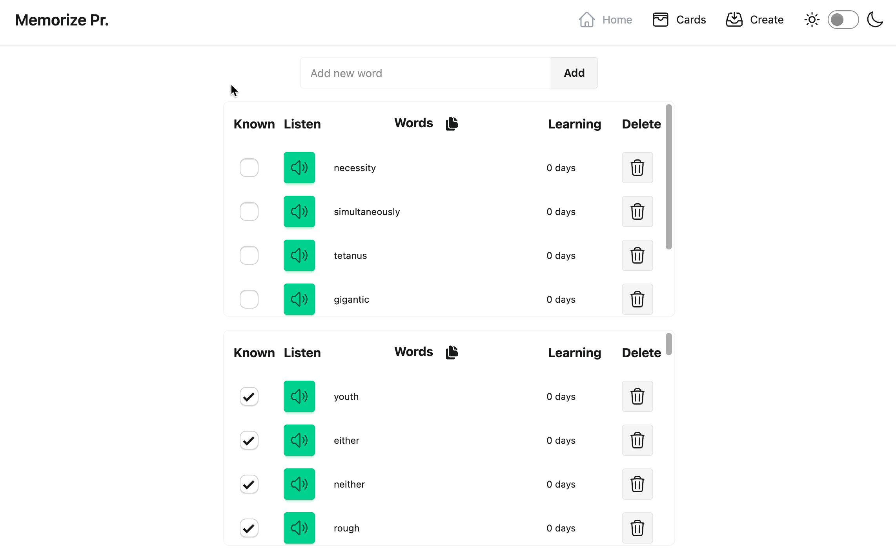
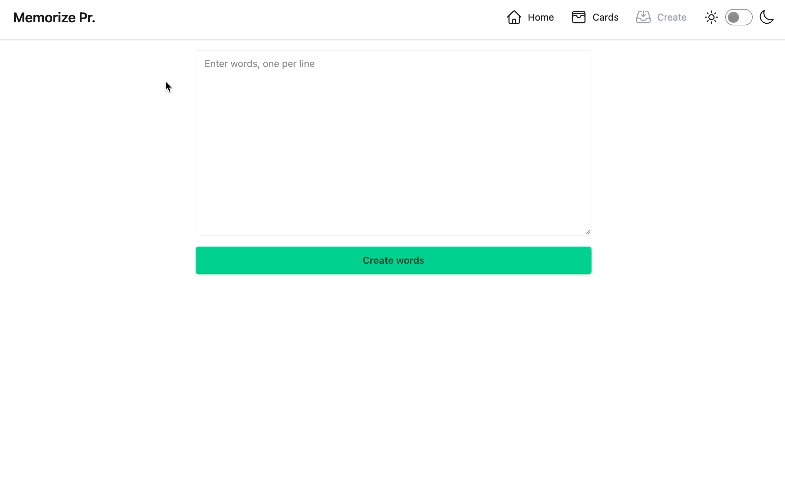
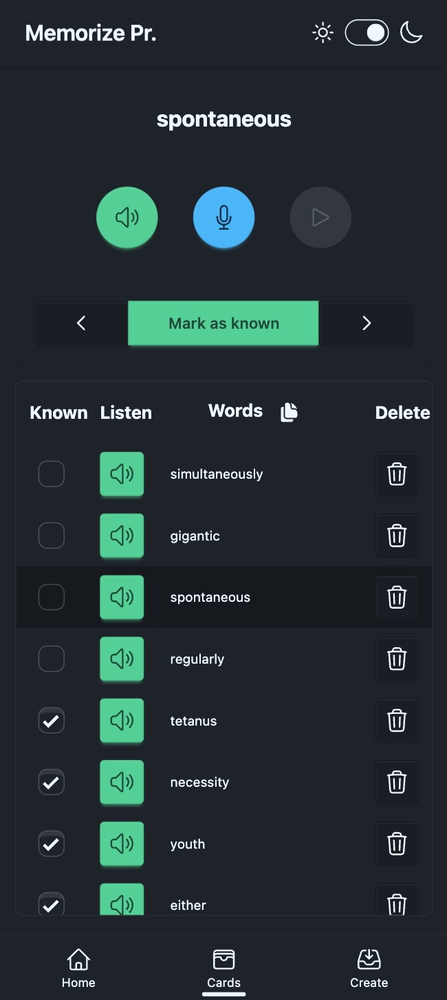

# Memorize Pronunciation

Improve your English pronunciation by listening, repeating, and recording yourself. Add new words, track progress, and review with cards.

## Home Page

* Search for a word
* Add a new word
* Delete a word
* Listen to the pronunciation of any word
* Mark words as known or reset learning with a checkbox
* Copy words directly from any table

<p align="center">

</p>

## Cards Page

* Review word cards
* Listen to the pronunciation of any word
* Record your pronunciation and listen to the recorded audio
* Mark words as known or reset learning
* Navigate using the keyboard
* Copy words directly from the table

<p align="center">

</p>

## Create Page

* Create list of words, enter one word per line
* Strip unnecessary characters from the list
* Skip duplicates

<p align="center">

</p>

## More Features

* Switch between light and dark themes
* Mobile-friendly responsive design

<p align="center">

</p>

## Developing

Install dependencies:

```bash
npm install
```

Start a development server:

```bash
npm run dev
```

Run tests:

```bash
npm run test
```

## Building

Create a production version of your app:

```bash
npm run build
```

It generates build into `.svetle-kit/output` folder.

Preview the production build:

```bash
npm run preview
```

## Certificate

Features like microphone access require both **HTTPS** and  **user permissions**. Mobile browsers  **only allow microphone access over `https://` or `localhost`** .

1. Run the app with `server.host: true` set in the `vite.config.ts` file. This will allow Vite to bind to all available network interfaces. Check the terminal output to find the list of network IPs accessible from other devices on your local network.
2. Choose your preferred local IP (e.g., 192.168.100.92) and update your Vite config:

```ts
server: {
  host: '192.168.100.92',
  port: 5173,
}
```

4. Set up your local certificate authority:

```bash
mkcert -install
```

This command installs a local trusted certificate authority (CA) on your development machine, which is required to generate trusted HTTPS certificates. Using trusted HTTPS certificates prevents your site from showing dangerous site warnings in Chrome browser (it may not work for other browsers).

4. Install mkcert and generate an HTTPS certificate for your development IP:

```bash
mkcert 192.168.100.92
```

This will generate two files:

* 192.168.100.92.pem
* 192.168.100.92-key.pem

5. Place these certificate files in a `certificate/` folder, and configure your Vite dev server to use them in vite.config.ts:

```ts
import fs from 'fs';

server: {
  host: '192.168.100.92',
  port: 5173,
  https: {
    key: fs.readFileSync('certificate/192.168.100.92-key.pem'),
    cert: fs.readFileSync('certificate/192.168.100.92.pem')
  }
}
```

6. Now, when you run the app with `npm run dev`, you can access it securely from other devices on your network via:

```bash
https://192.168.100.92:5173
```

