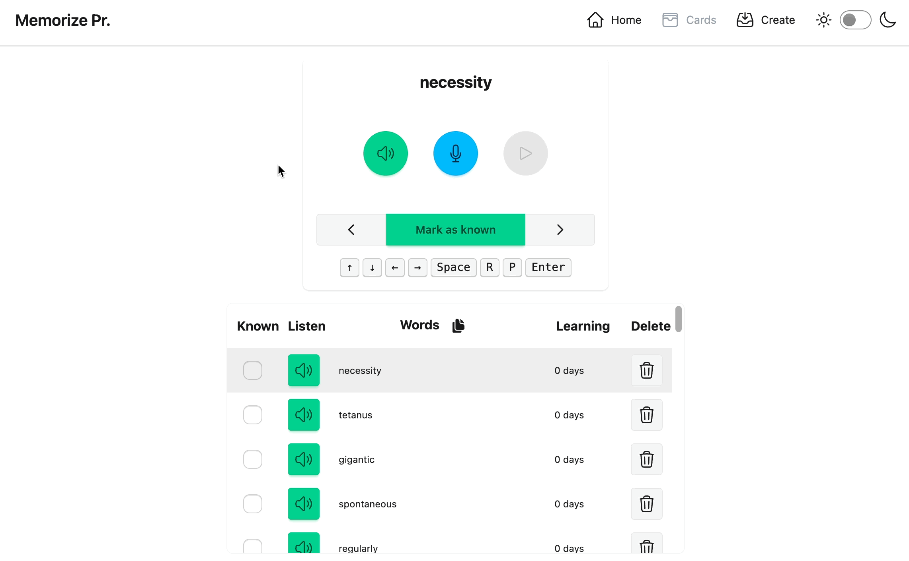
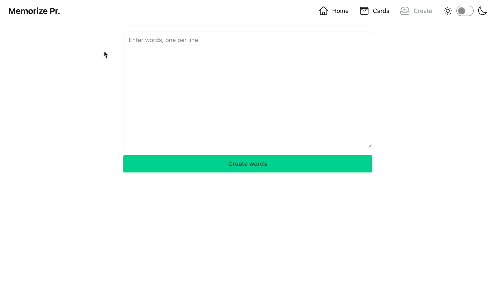

# Memorize Pronunciation

Improve your English pronunciation by listening, repeating, and recording yourself. Add new words, track progress, and review with cards.

## Home Page

* Search for a word
* Add a new word
* Delete a word
* Listen to the pronunciation of any word
* Mark words as known or reset learning with a checkbox
* Copy words directly from any table

<p align="center">

</p>

## Cards Page

* Review word cards
* Listen to the pronunciation of any word
* Record your pronunciation and listen to the recorded audio
* Mark words as known or reset learning
* Navigate using the keyboard
* Copy words directly from the table

<p align="center">

</p>

## Create Page

* Create list of words, enter one word per line
* Strip unnecessary characters from the list
* Skip duplicates

<p align="center">

</p>

## More Features

* Switch between light and dark themes
* Mobile-friendly responsive design

<p align="center">

</p>

## Developing

Install dependencies:

```bash
npm install
```

Start a development server:

```bash
npm run dev
```

Run tests:

```bash
npm run test
```

## Building

Create a production version of your app in `build` folder:

```bash
npm run build
```

Preview the production build:

```bash
npm run preview
```

## Certificate

Features like microphone access require both **HTTPS** and  **user permissions**. Mobile browsers  **only allow microphone access over `https://` or `localhost`** .

The certificate is generated automatically each time you run `npm run dev` or when it expires on the server.

Alternative: [Manually Generate a Certificate for a Local IP](./docs/README-CERTIFICATE.md)

## Hostname as URL

Set the hostname of your computer. For example, on macOS, you can change it under  **System Settings > Sharing > Local Hostname**. After updating the hostname, reconnect to Wi-Fi to apply the changes to your router.

If your hostname is `my-computer.local`, you’ll be able to access the site from other devices using:

```bash
https://my-computer.local:5173
```

## Server

* [Local Server on MacOS](./docs/README-SERVER-MACOS.md)
